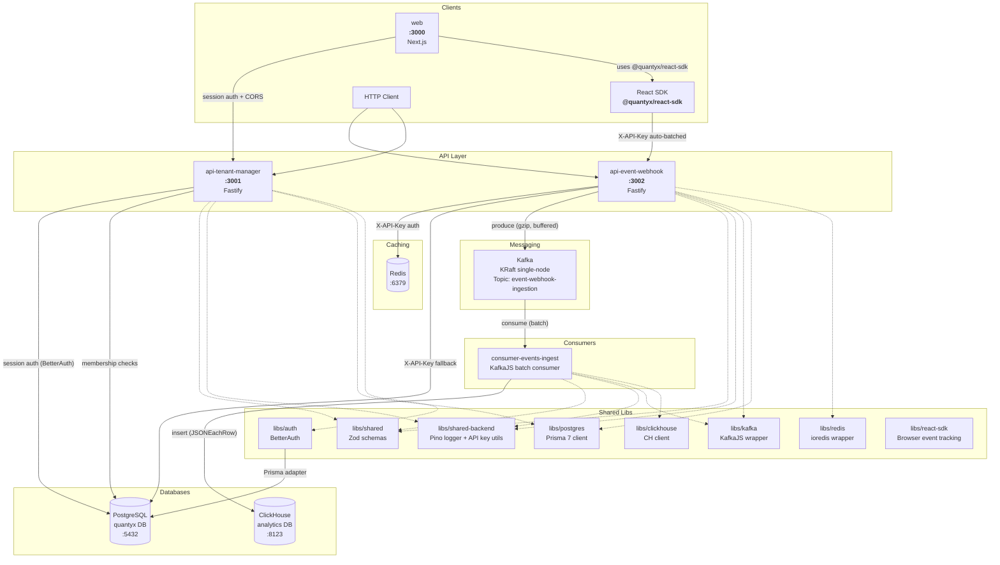
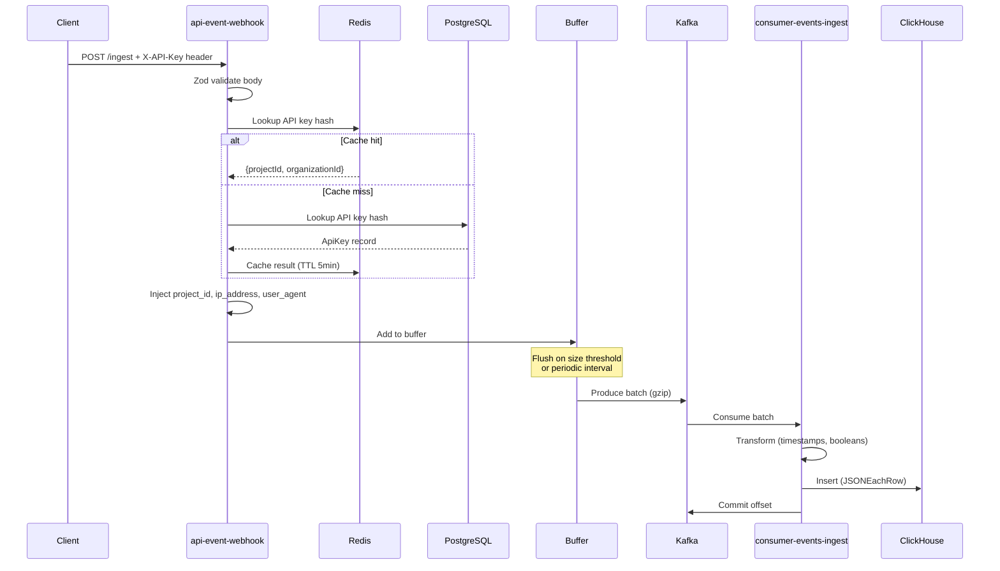
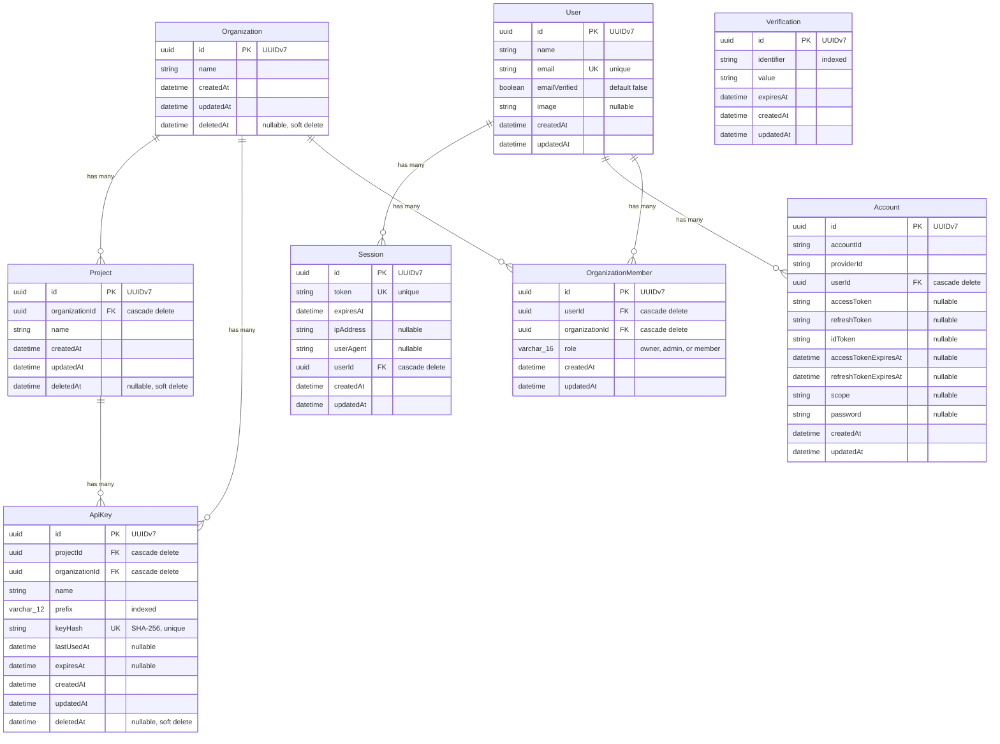
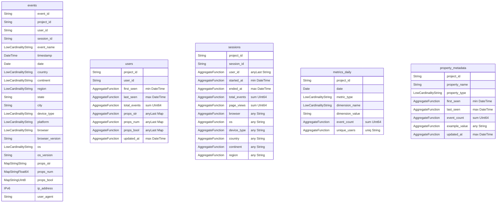
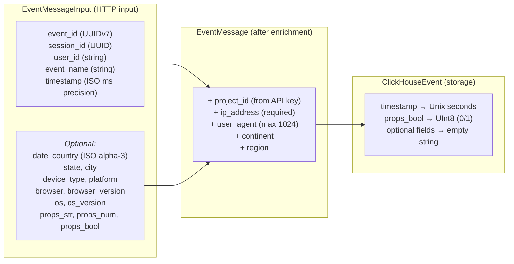

# Quantyx — Project Overview

A multi-tenant event analytics platform. Users send behavioral events (page views, clicks, custom actions) via HTTP, which flow through Kafka into ClickHouse for analytics, with tenant/organization management backed by PostgreSQL.

**Runtime**: Node.js 24 | **Package Manager**: pnpm 10.30 | **Language**: TypeScript 5.9 | **Monorepo**: Nx 22.5

---

## Architecture

### System Diagram

### Data Flow

---

## Apps

### api-event-webhook (port 3002)

Event ingestion API. Authenticates requests via per-project API keys, validates incoming events, enriches them with request metadata and project context, buffers them client-side, and produces to Kafka.

**Authentication**: All `/ingest` and `/ingest-bulk` requests require an `X-API-Key` header. The key is hashed (SHA-256) and looked up in Redis (cache) then PostgreSQL (fallback). On success, `project_id` and `organization_id` are resolved and injected into the event. `/healthz` and `/docs` are unauthenticated.

| Route          | Method | Description                                   |
| -------------- | ------ | --------------------------------------------- |
| `/ingest`      | POST   | Single event ingestion (requires `X-API-Key`) |
| `/ingest-bulk` | POST   | Batch event ingestion (requires `X-API-Key`)  |
| `/healthz`     | GET    | Kafka, Redis, Postgres connectivity status    |
| `/docs`        | GET    | Swagger UI                                    |

**Kafka producer behavior**:

- Client-side buffering with configurable max size (`EVENTS_MAX_BUFFER_SIZE`, default 100) and flush interval (`EVENTS_BUFFER_FLUSH_INTERVAL`, default 5000ms)
- GZIP compression
- Graceful shutdown: retries flushing up to 10 times before giving up

**Environment variables**:

| Variable                       | Default                   | Description                              |
| ------------------------------ | ------------------------- | ---------------------------------------- |
| `HOST`                         | `localhost`               | Bind address                             |
| `PORT`                         | `3000`                    | Bind port                                |
| `LOG_LEVEL`                    | `info`                    | debug, info, warn, error                 |
| `EVENT_TOPIC`                  | `event-webhook-ingestion` | Kafka topic                              |
| `EVENTS_MAX_BUFFER_SIZE`       | `100`                     | Flush buffer when this size is reached   |
| `EVENTS_BUFFER_FLUSH_INTERVAL` | `5000`                    | Flush interval in ms                     |
| `POSTGRES_URL`                 | _(required)_              | PostgreSQL connection string             |
| `REDIS_URL`                    | `redis://localhost:6379`  | Redis connection string                  |
| `API_KEY_CACHE_TTL_SECONDS`    | `300`                     | API key cache TTL in Redis               |
| `KAFKA_BROKERS`                | _(required)_              | Comma-separated broker list              |
| `KAFKA_CLIENT_ID`              | `api-event-webhook`       | Kafka client ID                          |
| `KAFKA_SSL_ENABLED`            | `false`                   | Enable SSL                               |
| `KAFKA_SASL_MECHANISM`         | _(optional)_              | plain, scram-sha-256, scram-sha-512, aws |
| `KAFKA_SASL_USERNAME`          | _(if SASL)_               | SASL username                            |
| `KAFKA_SASL_PASSWORD`          | _(if SASL)_               | SASL password                            |

---

### api-tenant-manager (port 3001)

Tenant/organization management API. CRUD operations for organizations, projects, API keys, and organization members with soft-delete pattern and role-based authorization.

**Authentication**: All routes require a valid BetterAuth session cookie (email/password). Email verification is required before sign-in. Password reset is supported via email. Public paths: `/healthz`, `/docs`, `/api/auth/*`.

**Authorization**: Organization membership is enforced on all data routes via a `verifyOrgMembership` Fastify decorator. Projects and API keys inherit access from their parent organization. Role hierarchy: `owner > admin > member`.

| Route                               | Method | Min Role   | Description                                                        |
| ----------------------------------- | ------ | ---------- | ------------------------------------------------------------------ |
| `/organizations`                    | GET    | member     | List organizations the user belongs to                             |
| `/organizations`                    | POST   | _(any)_    | Create organization (caller becomes owner)                         |
| `/organizations/:id`                | GET    | member     | Get organization by ID                                             |
| `/organizations/:id`                | PATCH  | admin      | Update organization                                                |
| `/organizations/:id`                | DELETE | admin      | Soft-delete organization                                           |
| `/organizations/:orgId/projects`    | GET    | member     | List projects for org                                              |
| `/organizations/:orgId/projects`    | POST   | member     | Create project under org                                           |
| `/projects/:id`                     | GET    | member     | Get project by ID                                                  |
| `/projects/:id`                     | PATCH  | admin      | Update project                                                     |
| `/projects/:id`                     | DELETE | admin      | Soft-delete project                                                |
| `/projects/:projectId/api-keys`     | GET    | member     | List API keys for project                                          |
| `/projects/:projectId/api-keys`     | POST   | admin      | Create API key (returns plaintext once)                            |
| `/api-keys/:id`                     | GET    | member     | Get API key metadata                                               |
| `/api-keys/:id`                     | DELETE | admin      | Revoke (soft-delete) API key                                       |
| `/organizations/:orgId/members`     | GET    | member     | List organization members                                          |
| `/organizations/:orgId/members`     | POST   | admin      | Add member by email                                                |
| `/organizations/:orgId/members/:id` | PATCH  | owner      | Update member role                                                 |
| `/organizations/:orgId/members/:id` | DELETE | owner      | Remove member                                                      |
| `/api/auth/*`                       | \*     | _(public)_ | BetterAuth routes (sign-up, sign-in, verify email, reset password) |
| `/healthz`                          | GET    | _(public)_ | DB connectivity status                                             |
| `/docs`                             | GET    | _(public)_ | Swagger UI                                                         |

**Soft-delete pattern**: DELETE sets `deletedAt = now()`. All queries filter `WHERE deletedAt IS NULL`. Records remain in DB for audit trail. Organization members are hard-deleted (no soft-delete).

**Plugin load order** (`@fastify/autoload`, numeric prefix): 0. `00-cors.ts` — `@fastify/cors` with `credentials: true`, origin from `WEB_APP_URL`

1. `01-sensible.ts` — `@fastify/sensible` (HTTP error utilities)
2. `02-auth-routes.ts` — BetterAuth route handler at `/api/auth/*`
3. `03-session-auth.ts` — Session validation preHandler (populates `request.userId`, `request.userEmail`, `request.userName`); skips public paths
4. `04-authorization.ts` — Decorates `fastify.verifyOrgMembership(request, orgId, { minRole? })` for route-level authorization

**Environment variables**:

| Variable       | Default                 | Description                  |
| -------------- | ----------------------- | ---------------------------- |
| `HOST`         | `localhost`             | Bind address                 |
| `PORT`         | `3001`                  | Bind port                    |
| `LOG_LEVEL`    | `info`                  | debug, info, warn, error     |
| `DATABASE_URL` | _(required)_            | PostgreSQL connection string |
| `WEB_APP_URL`  | `http://localhost:3000` | Frontend origin for CORS     |

Auth-related env vars (validated by `libs/auth`):

| Variable                          | Default                 | Description                                                                                                             |
| --------------------------------- | ----------------------- | ----------------------------------------------------------------------------------------------------------------------- |
| `API_TENANT_MANAGER_EXTERNAL_URL` | `http://localhost:3001` | Externally-reachable URL of api-tenant-manager; used by BetterAuth to build email verification and password reset links |
| `BETTER_AUTH_SECRET`              | _(required)_            | BetterAuth session secret                                                                                               |
| `SMTP_HOST`                       | _(required)_            | SMTP host for email verification/reset                                                                                  |
| `SMTP_PORT`                       | `587`                   | SMTP port                                                                                                               |
| `SMTP_SECURE`                     | `false`                 | Use TLS for SMTP                                                                                                        |
| `SMTP_USER`                       | _(required)_            | SMTP username                                                                                                           |
| `SMTP_PASS`                       | _(required)_            | SMTP password                                                                                                           |
| `SMTP_FROM`                       | _(required)_            | From address for emails                                                                                                 |

---

### web (port 3000)

Next.js App Router frontend for authentication and tenant management. Communicates directly with `api-tenant-manager` via session cookies + CORS.

**Stack**: Next.js 16, React 19, Tailwind CSS v4, shadcn/ui, TanStack Query, BetterAuth React client.

**Auth pages**: Login, Register, Verify Email, Forgot Password, Reset Password.

**Dashboard pages**: Organizations (list/create), Organization detail (projects list/create), Organization settings (edit/delete), Members (list/add/role change/remove), Project detail (API keys list/create/delete), Project settings (edit/delete).

| Route                                                | Description                   |
| ---------------------------------------------------- | ----------------------------- |
| `/login`                                             | Sign in with email + password |
| `/register`                                          | Create account                |
| `/verify-email`                                      | Email verification info       |
| `/forgot-password`                                   | Request password reset        |
| `/reset-password`                                    | Set new password (with token) |
| `/organizations`                                     | List + create organizations   |
| `/organizations/:orgId`                              | Org detail with projects list |
| `/organizations/:orgId/settings`                     | Edit/delete organization      |
| `/organizations/:orgId/members`                      | Manage members                |
| `/organizations/:orgId/projects/:projectId`          | Project detail with API keys  |
| `/organizations/:orgId/projects/:projectId/settings` | Edit/delete project           |

**Session guard**: Dashboard layout uses `useSession()` from BetterAuth React client; redirects to `/login` if unauthenticated.

**Analytics instrumentation**: Integrated with `@quantyx/react-sdk`. The `QuantyxProvider` is conditionally rendered in `providers.tsx` (only when `NEXT_PUBLIC_QUANTYX_API_KEY` is set). Safe no-op wrapper hooks (`useAnalyticsTrack`, `useAnalyticsIdentify`, `usePageView`) in `src/hooks/use-analytics.ts` gracefully degrade when the SDK is unconfigured. Tracked events: `page_view` on every pathname change (dashboard + auth), `sign_out` on sign-out click, and `identify(userId)` when the dashboard session loads.

**Environment variables**:

| Variable                         | Default                 | Description                                           |
| -------------------------------- | ----------------------- | ----------------------------------------------------- |
| `NEXT_PUBLIC_API_URL`            | `http://localhost:3001` | api-tenant-manager URL                                |
| `NEXT_PUBLIC_QUANTYX_API_KEY`    | _(optional)_            | API key for event tracking; omit to disable analytics |
| `NEXT_PUBLIC_QUANTYX_INGEST_URL` | `http://localhost:3002` | api-event-webhook URL for SDK                         |

---

### consumer-events-ingest

Kafka consumer that processes event messages in batches and persists them to ClickHouse. Downstream aggregation (users, sessions, metrics, property metadata) is handled automatically by ClickHouse materialized views on insert — no application code needed.

- Batch processing with heartbeat management (heartbeat every `SESSION_TIMEOUT / 3`)
- Auto-commit disabled; offset committed only after successful ClickHouse insert
- Transforms events: ISO timestamps to Unix seconds (using UTC date methods), booleans to UInt8

**Environment variables**:

| Variable                       | Default                        | Description                 |
| ------------------------------ | ------------------------------ | --------------------------- |
| `LOG_LEVEL`                    | `info`                         | debug, info, warn, error    |
| `EVENT_TOPIC`                  | `event-webhook-ingestion`      | Kafka topic to consume      |
| `KAFKA_CONSUMER_GROUP_ID`      | `consumer-events-ingest-group` | Consumer group              |
| `KAFKA_CONSUME_FROM_BEGINNING` | `false`                        | Read from earliest offset   |
| `KAFKA_SESSION_TIMEOUT_MS`     | `30000`                        | Session timeout             |
| `KAFKA_BROKERS`                | _(required)_                   | Comma-separated broker list |
| `CLICKHOUSE_URL`               | `http://localhost:8123`        | ClickHouse HTTP endpoint    |
| `CLICKHOUSE_USER`              | `default`                      | ClickHouse user             |
| `CLICKHOUSE_PASSWORD`          | _(empty)_                      | ClickHouse password         |
| `CLICKHOUSE_DATABASE`          | `analytics`                    | ClickHouse database         |

---

## Libs

| Lib                | Purpose                                                                                                                                                                                                                                                                                                                                                                                                                                                                                                                                                                                                                                                                                                                |
| ------------------ | ---------------------------------------------------------------------------------------------------------------------------------------------------------------------------------------------------------------------------------------------------------------------------------------------------------------------------------------------------------------------------------------------------------------------------------------------------------------------------------------------------------------------------------------------------------------------------------------------------------------------------------------------------------------------------------------------------------------------- |
| **shared**         | Zod schemas for events (`EventMessageInput`, `EventMessage`), tenant management (`OrganizationBody/Response`, `ProjectBody/Response`, `ApiKeyBody/Response/CreatedResponse`), membership (`MemberRole`, `AddMemberBody`, `UpdateMemberRoleBody`, `MemberResponse`), country/continent/region validators. Country data is a generated static file (`country-data.ts`) with no Node-only dependencies — browser-compatible.                                                                                                                                                                                                                                                                                              |
| **shared-backend** | Pino logger factory with child logger context support; API key crypto utilities (`generateApiKey`, `hashApiKey`)                                                                                                                                                                                                                                                                                                                                                                                                                                                                                                                                                                                                       |
| **kafka**          | KafkaJS client wrapper with SASL support (plain, scram-sha-256/512, aws)                                                                                                                                                                                                                                                                                                                                                                                                                                                                                                                                                                                                                                               |
| **clickhouse**     | ClickHouse client wrapper with compression, health check, `ClickHouseEvent` type definition                                                                                                                                                                                                                                                                                                                                                                                                                                                                                                                                                                                                                            |
| **postgres**       | Prisma 7 client singleton with `@prisma/adapter-pg` connection pooling                                                                                                                                                                                                                                                                                                                                                                                                                                                                                                                                                                                                                                                 |
| **redis**          | ioredis client wrapper with lazy connect, health check, connect/disconnect helpers                                                                                                                                                                                                                                                                                                                                                                                                                                                                                                                                                                                                                                     |
| **auth**           | BetterAuth singleton with Prisma adapter. Owns its own Zod-validated env (`API_TENANT_MANAGER_EXTERNAL_URL`, `BETTER_AUTH_SECRET`, `SMTP_*`). Supports email/password auth, email verification (send on sign-up, auto sign-in after verification), password reset via SMTP.                                                                                                                                                                                                                                                                                                                                                                                                                                            |
| **react-sdk**      | Publishable browser event tracking SDK (`@quantyx/react-sdk`). Vanilla JS core (`QuantyxClient`) with auto-batching, UUIDv7 event IDs, session management (`sessionStorage`), and browser/device auto-detection (Client Hints + UA fallback). React bindings (`QuantyxProvider`, `useTrack`, `useIdentify`) via separate `@quantyx/react-sdk/react` entry point. Sends batched events to `api-event-webhook` via `POST /ingest-bulk` with `X-API-Key` header. Uses `navigator.sendBeacon()` on page hide for reliable delivery. React is an optional peer dependency — core works without it. Built with `tsc` to `dist/` (JS + declarations); `@quantyx/source` export condition enables workspace source resolution. |

---

## Data Models

### PostgreSQL (Prisma)

All IDs use database-generated UUIDv7.

**Key indexes**:

- `OrganizationMember`: unique composite `(userId, organizationId)`, indexes on `organizationId` and `userId`
- `ApiKey`: unique `keyHash`, indexes on `prefix`, `projectId`, `organizationId`

### ClickHouse (Analytics)

All aggregate tables use `AggregatingMergeTree` with `-State` columns. Queries must use `-Merge` combinators (e.g., `sumMerge(total_events)`) with `GROUP BY` on the ORDER BY key columns.

| Table               | Engine               | Partition           | Order By                                                       | Notes                                             |
| ------------------- | -------------------- | ------------------- | -------------------------------------------------------------- | ------------------------------------------------- |
| `events`            | MergeTree            | Monthly (`YYYY-MM`) | project_id, date, event_name, user_id, timestamp               | 90-day TTL, bloom filter on event_name & user_id  |
| `users`             | AggregatingMergeTree | —                   | project_id, user_id                                            | Per-user aggregates; excludes anonymous events    |
| `sessions`          | AggregatingMergeTree | —                   | project_id, session_id                                         | Per-session aggregates; excludes empty session_id |
| `metrics_daily`     | AggregatingMergeTree | Monthly             | project_id, date, metric_type, dimension_name, dimension_value | Pre-aggregated daily metrics across dimensions    |
| `property_metadata` | AggregatingMergeTree | —                   | project_id, property_name, property_type                       | Tracks custom property names/types per tenant     |

#### Materialized Views

All aggregate tables are auto-populated from `events` inserts via materialized views. Each MV is a separate `CREATE MATERIALIZED VIEW ... TO <target_table>` — ClickHouse does not reliably process all branches of a `UNION ALL` MV, so each dimension/type gets its own view.

| MV                          | Target Table        | Description                                                                                                                                                                                         |
| --------------------------- | ------------------- | --------------------------------------------------------------------------------------------------------------------------------------------------------------------------------------------------- |
| `mv_users`                  | `users`             | Per-user stats (first/last seen, total events, latest props). Filters `WHERE user_id != ''`                                                                                                         |
| `mv_sessions`               | `sessions`          | Per-session stats (start/end, total events, page_views count, device/location). Filters `WHERE session_id != ''`. Uses `sumState(toUInt64(if(event_name = 'page_view', 1, 0)))` for page view count |
| `mv_metrics_overall`        | `metrics_daily`     | Overall event count per project per day                                                                                                                                                             |
| `mv_metrics_event_name`     | `metrics_daily`     | Event count by `event_name`                                                                                                                                                                         |
| `mv_metrics_browser`        | `metrics_daily`     | Event count by `browser`                                                                                                                                                                            |
| `mv_metrics_os`             | `metrics_daily`     | Event count by `os`                                                                                                                                                                                 |
| `mv_metrics_device_type`    | `metrics_daily`     | Event count by `device_type`                                                                                                                                                                        |
| `mv_metrics_platform`       | `metrics_daily`     | Event count by `platform`                                                                                                                                                                           |
| `mv_metrics_country`        | `metrics_daily`     | Event count by `country`                                                                                                                                                                            |
| `mv_metrics_path`           | `metrics_daily`     | Event count by `props_str['path']` (page_view events only)                                                                                                                                          |
| `mv_property_metadata_str`  | `property_metadata` | String property keys from `props_str`                                                                                                                                                               |
| `mv_property_metadata_num`  | `property_metadata` | Numeric property keys from `props_num`                                                                                                                                                              |
| `mv_property_metadata_bool` | `property_metadata` | Boolean property keys from `props_bool`                                                                                                                                                             |

---

## Event Schema

---

## Infrastructure

### Docker Compose Services

| Service    | Image                                       | Port         | Purpose              |
| ---------- | ------------------------------------------- | ------------ | -------------------- |
| ClickHouse | `clickhouse/clickhouse-server:25.11-alpine` | 8123, 9000   | Analytics database   |
| PostgreSQL | `postgres:18-trixie`                        | 5432         | Tenant/auth database |
| Kafka      | `apache/kafka:4.1.1`                        | 29092 (host) | Event messaging      |
| Redis      | `redis:8-alpine`                            | 6379         | API key cache        |
| Kafbat UI  | `kafbat/kafka-ui:latest`                    | 8080         | Kafka management UI  |
| Grafana    | `grafana/grafana-oss:latest`                | 3003         | Analytics dashboards |

### CI/CD

GitHub Actions pipeline on push to `main` and pull requests:

- Node.js 24, pnpm, Nx Cloud (3 distributed agents)
- Parallel: lint, test, build, typecheck

### Dockerfiles

All 3 apps: `node:lts-alpine` + pnpm, copy `dist/`, `pnpm install`, `node main.js`

---

## Key Design Decisions

| Decision                                                   | Rationale                                                                                                                                                                                                                                                                                                                       |
| ---------------------------------------------------------- | ------------------------------------------------------------------------------------------------------------------------------------------------------------------------------------------------------------------------------------------------------------------------------------------------------------------------------- |
| Client-side Kafka buffering                                | Reduces per-event overhead; configurable batch size and flush interval                                                                                                                                                                                                                                                          |
| Soft deletes for tenants                                   | Preserves audit trail; records remain queryable                                                                                                                                                                                                                                                                                 |
| UUIDv7 for all IDs                                         | Time-ordered for better B-tree index performance                                                                                                                                                                                                                                                                                |
| Monthly ClickHouse partitions + 90-day TTL                 | Balances query performance with storage cost                                                                                                                                                                                                                                                                                    |
| Zod at API boundary                                        | Runtime type safety with auto-generated Swagger docs                                                                                                                                                                                                                                                                            |
| `@prisma/adapter-pg` connection pooling                    | Native pg Pool without needing PgBouncer                                                                                                                                                                                                                                                                                        |
| KRaft single-node Kafka                                    | Simplified dev setup without ZooKeeper                                                                                                                                                                                                                                                                                          |
| Nx monorepo with buildable libs                            | Independent builds and deploys per app                                                                                                                                                                                                                                                                                          |
| Per-project API keys with SHA-256 hash                     | Keys stored as hashes (never plaintext); prefix for identification; Redis cache with 5-min TTL                                                                                                                                                                                                                                  |
| `project_id` injected server-side                          | Clients authenticate with API key, server resolves project; prevents spoofing                                                                                                                                                                                                                                                   |
| Custom membership model (not BetterAuth org plugin)        | Avoids parallel org system conflicting with existing `Organization` model, routes, and tests                                                                                                                                                                                                                                    |
| Role as `VARCHAR(16)` validated by Zod enum                | Avoids Postgres enum migration hassle when adding roles later                                                                                                                                                                                                                                                                   |
| Authorization via Fastify decorator, not global preHandler | Org ID comes from different sources (`:orgId` param, entity lookup); explicit per-route calls are clearer                                                                                                                                                                                                                       |
| Hard-delete for memberships                                | No audit trail need; soft-delete would complicate every authorization query                                                                                                                                                                                                                                                     |
| BetterAuth with email verification                         | Requires email verification before sign-in; password reset via SMTP; session cookies for auth                                                                                                                                                                                                                                   |
| Direct API calls from frontend (no BFF)                    | Frontend uses `credentials: 'include'` + `@fastify/cors` with session cookies. Simpler than a proxy layer for MVP.                                                                                                                                                                                                              |
| Generated static country data                              | Replaced Node-only `country-code-lookup` with a script that fetches from restcountries.com and generates a pure TS file. Keeps `@quantyx/shared` browser-compatible.                                                                                                                                                            |
| React SDK: vanilla core + React bindings                   | Separate entry points (`@quantyx/react-sdk` and `@quantyx/react-sdk/react`) so the core works without React. React is an optional peer dep. UUIDs use `crypto.getRandomValues()` only (not `crypto.randomUUID()`) for non-secure-context compatibility. `sendBeacon` on page hide ensures events aren't lost during navigation. |
| React SDK: publishable with `@quantyx/source` condition    | Package exports point to compiled `dist/` output for registry consumers and Next.js Turbopack (which lacks `extensionAlias` support). Workspace consumers using `nodenext` resolution get source `.ts` files via the `@quantyx/source` custom export condition configured in `tsconfig.base.json`.                              |
| Conditional analytics provider                             | `QuantyxProvider` only renders when `NEXT_PUBLIC_QUANTYX_API_KEY` is set. Safe no-op wrapper hooks (`useAnalyticsTrack`, `useAnalyticsIdentify`, `usePageView`) allow instrumentation code to exist in layouts without breaking the app when analytics is disabled.                                                             |
