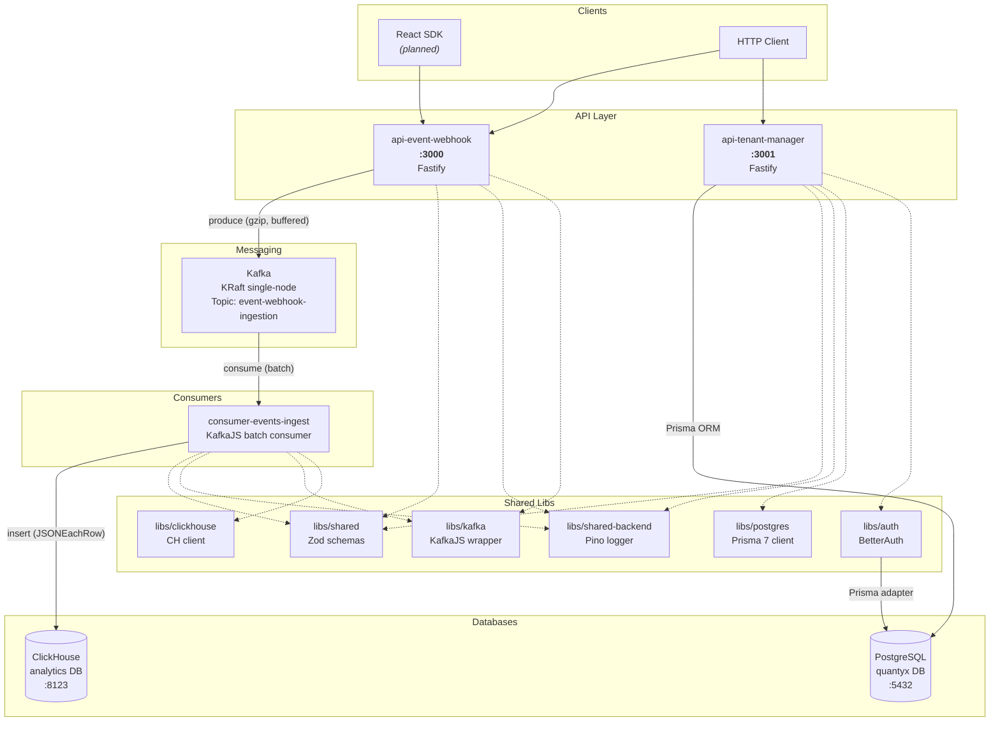
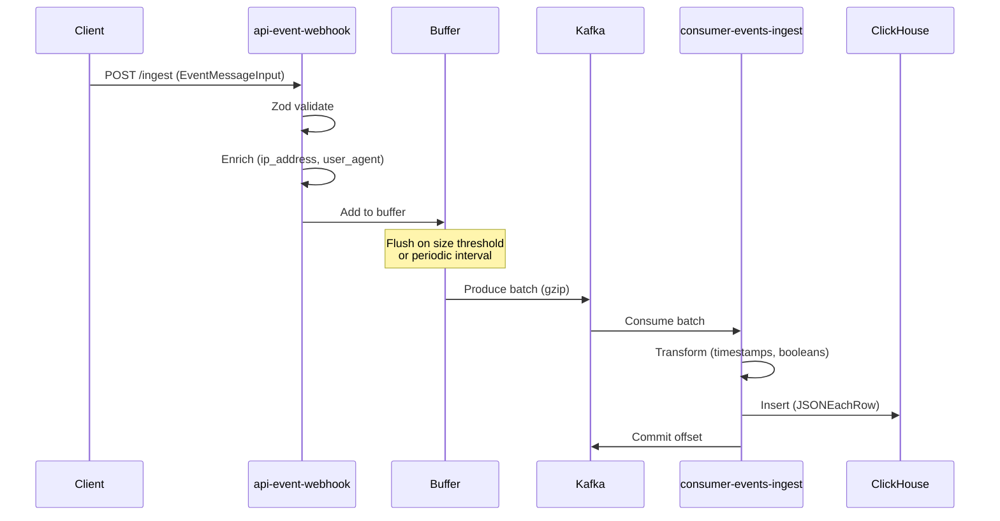
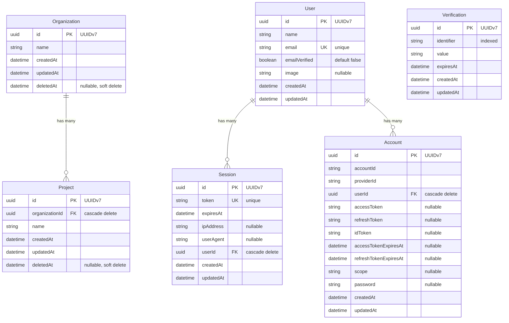
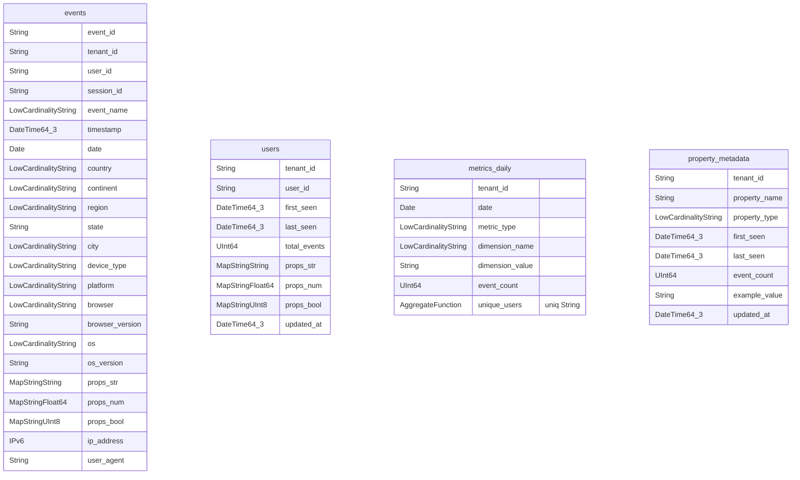
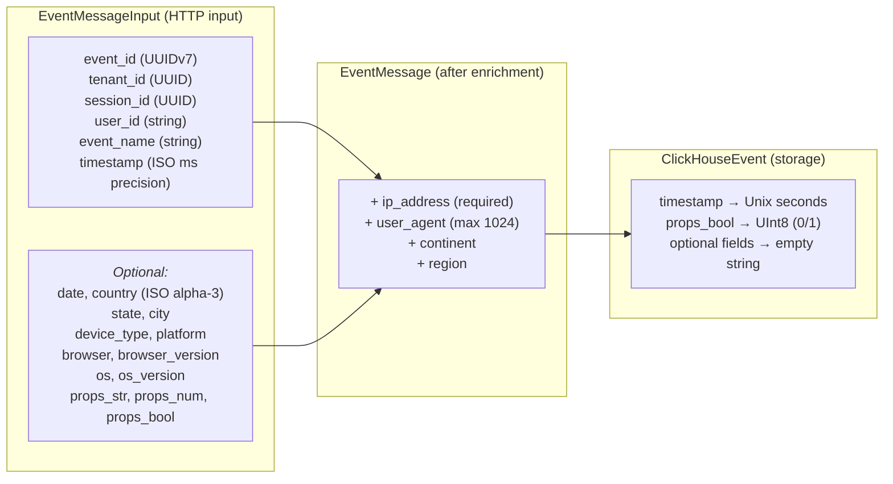

# Quantyx — Project Overview

A multi-tenant event analytics platform. Users send behavioral events (page views, clicks, custom actions) via HTTP, which flow through Kafka into ClickHouse for analytics, with tenant/organization management backed by PostgreSQL.

**Runtime**: Node.js 24 | **Package Manager**: pnpm 10.30 | **Language**: TypeScript 5.9 | **Monorepo**: Nx 22.5

---

## Architecture

### System Diagram

### Data Flow

---

## Apps

### api-event-webhook (port 3000)

Event ingestion API. Validates incoming events, enriches them with request metadata, buffers them client-side, and produces to Kafka.

| Route | Method | Description |
|---|---|---|
| `/ingest` | POST | Single event ingestion |
| `/ingest-bulk` | POST | Batch event ingestion (array) |
| `/healthz` | GET | Kafka connectivity status |
| `/docs` | GET | Swagger UI |

**Kafka producer behavior**:
- Client-side buffering with configurable max size (`EVENTS_MAX_BUFFER_SIZE`, default 100) and flush interval (`EVENTS_BUFFER_FLUSH_INTERVAL`, default 5000ms)
- GZIP compression
- Graceful shutdown: retries flushing up to 10 times before giving up

**Environment variables**:

| Variable | Default | Description |
|---|---|---|
| `HOST` | `localhost` | Bind address |
| `PORT` | `3000` | Bind port |
| `LOG_LEVEL` | `info` | debug, info, warn, error |
| `EVENT_TOPIC` | `event-webhook-ingestion` | Kafka topic |
| `EVENTS_MAX_BUFFER_SIZE` | `100` | Flush buffer when this size is reached |
| `EVENTS_BUFFER_FLUSH_INTERVAL` | `5000` | Flush interval in ms |
| `KAFKA_BROKERS` | *(required)* | Comma-separated broker list |
| `KAFKA_CLIENT_ID` | `api-event-webhook` | Kafka client ID |
| `KAFKA_SSL_ENABLED` | `false` | Enable SSL |
| `KAFKA_SASL_MECHANISM` | *(optional)* | plain, scram-sha-256, scram-sha-512, aws |
| `KAFKA_SASL_USERNAME` | *(if SASL)* | SASL username |
| `KAFKA_SASL_PASSWORD` | *(if SASL)* | SASL password |

---

### api-tenant-manager (port 3001)

Tenant/organization management API. CRUD operations for organizations and projects with soft-delete pattern.

| Route | Method | Description |
|---|---|---|
| `/organizations` | GET | List all active organizations |
| `/organizations` | POST | Create organization |
| `/organizations/:id` | GET | Get organization by ID |
| `/organizations/:id` | PATCH | Update organization |
| `/organizations/:id` | DELETE | Soft-delete organization |
| `/organizations/:orgId/projects` | GET | List projects for org |
| `/organizations/:orgId/projects` | POST | Create project under org |
| `/projects/:id` | GET | Get project by ID |
| `/projects/:id` | PATCH | Update project |
| `/projects/:id` | DELETE | Soft-delete project |
| `/healthz` | GET | DB connectivity status |
| `/docs` | GET | Swagger UI |

**Soft-delete pattern**: DELETE sets `deletedAt = now()`. All queries filter `WHERE deletedAt IS NULL`. Records remain in DB for audit trail.

**Environment variables**:

| Variable | Default | Description |
|---|---|---|
| `HOST` | `localhost` | Bind address |
| `PORT` | `3001` | Bind port |
| `LOG_LEVEL` | `info` | debug, info, warn, error |
| `DATABASE_URL` | *(required)* | PostgreSQL connection string |

---

### consumer-events-ingest

Kafka consumer that processes event messages in batches and persists them to ClickHouse.

- Batch processing with heartbeat management (heartbeat every `SESSION_TIMEOUT / 3`)
- Auto-commit disabled; offset committed only after successful ClickHouse insert
- Transforms events: ISO timestamps to Unix seconds, booleans to UInt8

**Environment variables**:

| Variable | Default | Description |
|---|---|---|
| `LOG_LEVEL` | `info` | debug, info, warn, error |
| `EVENT_TOPIC` | `event-webhook-ingestion` | Kafka topic to consume |
| `KAFKA_CONSUMER_GROUP_ID` | `consumer-events-ingest-group` | Consumer group |
| `KAFKA_CONSUME_FROM_BEGINNING` | `false` | Read from earliest offset |
| `KAFKA_SESSION_TIMEOUT_MS` | `30000` | Session timeout |
| `KAFKA_BROKERS` | *(required)* | Comma-separated broker list |
| `CLICKHOUSE_URL` | `http://localhost:8123` | ClickHouse HTTP endpoint |
| `CLICKHOUSE_USER` | `default` | ClickHouse user |
| `CLICKHOUSE_PASSWORD` | *(empty)* | ClickHouse password |
| `CLICKHOUSE_DATABASE` | `analytics` | ClickHouse database |

---

## Libs

| Lib | Purpose |
|---|---|
| **shared** | Zod schemas for events (`EventMessageInput`, `EventMessage`), tenant management (`OrganizationBody/Response`, `ProjectBody/Response`), country/continent/region validators |
| **shared-backend** | Pino logger factory with child logger context support |
| **kafka** | KafkaJS client wrapper with SASL support (plain, scram-sha-256/512, aws) |
| **clickhouse** | ClickHouse client wrapper with compression, health check, `ClickHouseEvent` type definition |
| **postgres** | Prisma 7 client singleton with `@prisma/adapter-pg` connection pooling |
| **auth** | BetterAuth configured with Prisma adapter (scaffolded, no routes exposed yet) |

---

## Data Models

### PostgreSQL (Prisma)

All IDs use database-generated UUIDv7.

### ClickHouse (Analytics)

| Table | Engine | Partition | Order By | Notes |
|---|---|---|---|---|
| `events` | MergeTree | Monthly (`YYYY-MM`) | tenant_id, date, event_name, user_id, timestamp | 90-day TTL, bloom filter on event_name & user_id |
| `users` | ReplacingMergeTree | — | tenant_id, user_id | Deduplicates by updated_at |
| `metrics_daily` | AggregatingMergeTree | Monthly | tenant_id, date, metric_type, dimension_name, dimension_value | Pre-aggregated daily metrics |
| `property_metadata` | ReplacingMergeTree | — | tenant_id, property_name | Tracks property names/types per tenant |

---

## Event Schema

---

## Infrastructure

### Docker Compose Services

| Service | Image | Port | Purpose |
|---|---|---|---|
| ClickHouse | `clickhouse/clickhouse-server:25.11-alpine` | 8123, 9000 | Analytics database |
| PostgreSQL | `postgres:18-trixie` | 5432 | Tenant/auth database |
| Kafka | `apache/kafka:4.1.1` | 29092 (host) | Event messaging |
| Kafbat UI | `kafbat/kafka-ui:latest` | 8080 | Kafka management UI |

### CI/CD

GitHub Actions pipeline on push to `main` and pull requests:
- Node.js 24, pnpm, Nx Cloud (3 distributed agents)
- Parallel: lint, test, build, typecheck

### Dockerfiles

All 3 apps: `node:lts-alpine` + pnpm, copy `dist/`, `pnpm install`, `node main.js`

---

## Test Coverage

| Project | Tests | Type | Infrastructure |
|---|---|---|---|
| shared | 20 | Unit | None |
| auth | 3 | Unit (mocked) | None |
| clickhouse | 6 | Unit (mocked) | None |
| api-tenant-manager | 27 | Integration | Testcontainers PostgreSQL |
| api-event-webhook | 7 | Integration | Testcontainers Kafka |
| consumer-events-ingest | 0 | — | — |
| **Total** | **63** | | |

Test framework: **Vitest 3** with `globals: true`, `pool: 'forks'`, `server.deps.inline: true`

---

## Key Design Decisions

| Decision | Rationale |
|---|---|
| Client-side Kafka buffering | Reduces per-event overhead; configurable batch size and flush interval |
| Soft deletes for tenants | Preserves audit trail; records remain queryable |
| UUIDv7 for all IDs | Time-ordered for better B-tree index performance |
| Monthly ClickHouse partitions + 90-day TTL | Balances query performance with storage cost |
| Zod at API boundary | Runtime type safety with auto-generated Swagger docs |
| `@prisma/adapter-pg` connection pooling | Native pg Pool without needing PgBouncer |
| KRaft single-node Kafka | Simplified dev setup without ZooKeeper |
| Nx monorepo with buildable libs | Independent builds and deploys per app |
