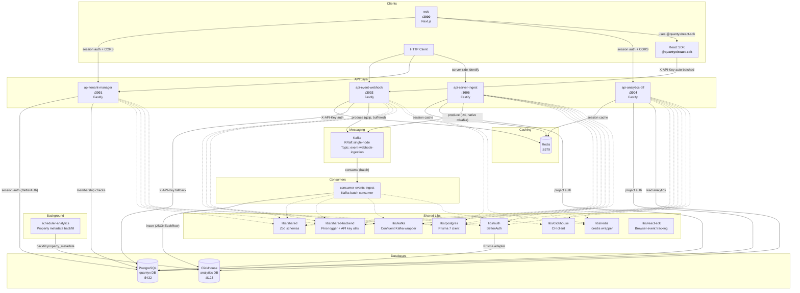
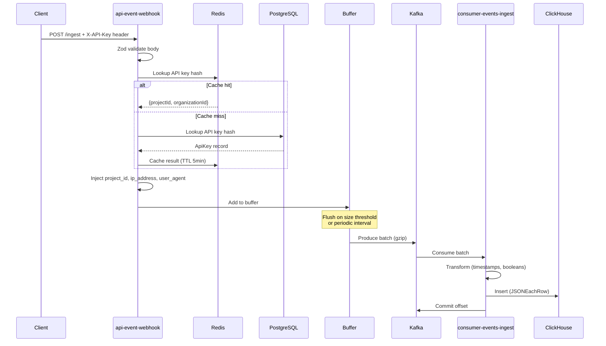
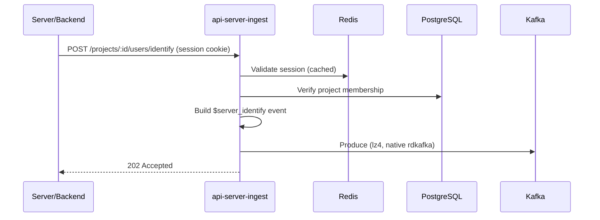

# Quantyx — Project Overview

A multi-tenant event analytics platform. Users send behavioral events (page views, clicks, custom actions) via HTTP, which flow through Kafka into ClickHouse for analytics, with tenant/organization management backed by PostgreSQL.

**Runtime**: Node.js 24 | **Package Manager**: pnpm 10.33 | **Language**: TypeScript 5.9 | **Monorepo**: Nx 22.6

---

## Architecture

### System Diagram

### Data Flow

#### Server-Side Identification Flow

---

## Apps

### api-event-webhook (port 3002)

Event ingestion API. Authenticates requests via per-project API keys, validates incoming events, enriches them with request metadata and project context, buffers them client-side, and produces to Kafka.

**Authentication**: All `/ingest` and `/ingest-bulk` requests require an `X-API-Key` header. The key is hashed (SHA-256) and looked up in Redis (cache) then PostgreSQL (fallback). On success, `project_id` and `organization_id` are resolved and injected into the event. `/healthz` and `/docs` are unauthenticated.

| Route          | Method | Description                                   |
| -------------- | ------ | --------------------------------------------- |
| `/ingest`      | POST   | Single event ingestion (requires `X-API-Key`) |
| `/ingest-bulk` | POST   | Batch event ingestion (requires `X-API-Key`)  |
| `/healthz`     | GET    | Kafka, Redis, Postgres connectivity status    |
| `/docs`        | GET    | Swagger UI                                    |

**Kafka producer behavior**:

- Client-side buffering with configurable max size (`EVENTS_MAX_BUFFER_SIZE`, default 100) and flush interval (`EVENTS_BUFFER_FLUSH_INTERVAL`, default 5000ms)
- GZIP compression
- Graceful shutdown: retries flushing up to 10 times before giving up

**Environment**: See `apps/api-event-webhook/.env.example`.

---

### api-tenant-manager (port 3001)

Tenant/organization management API. CRUD operations for organizations, projects, API keys, and organization members with soft-delete pattern and role-based authorization.

**Authentication**: All routes require a valid BetterAuth session cookie (email/password). Email verification is required before sign-in. Password reset is supported via email. Public paths: `/healthz`, `/docs`, `/api/auth/*`.

**Authorization**: Organization membership is enforced on all data routes via a `verifyOrgMembership` Fastify decorator. Projects and API keys inherit access from their parent organization. Role hierarchy: `owner > admin > member`.

| Route                               | Method | Min Role   | Description                                                        |
| ----------------------------------- | ------ | ---------- | ------------------------------------------------------------------ |
| `/organizations`                    | GET    | member     | List organizations the user belongs to                             |
| `/organizations`                    | POST   | _(any)_    | Create organization (caller becomes owner)                         |
| `/organizations/:id`                | GET    | member     | Get organization by ID                                             |
| `/organizations/:id`                | PATCH  | admin      | Update organization                                                |
| `/organizations/:id`                | DELETE | admin      | Soft-delete organization                                           |
| `/organizations/:orgId/projects`    | GET    | member     | List projects for org                                              |
| `/organizations/:orgId/projects`    | POST   | member     | Create project under org                                           |
| `/projects/:id`                     | GET    | member     | Get project by ID                                                  |
| `/projects/:id`                     | PATCH  | admin      | Update project                                                     |
| `/projects/:id`                     | DELETE | admin      | Soft-delete project                                                |
| `/projects/:projectId/api-keys`     | GET    | member     | List API keys for project                                          |
| `/projects/:projectId/api-keys`     | POST   | admin      | Create API key (returns plaintext once)                            |
| `/api-keys/:id`                     | GET    | member     | Get API key metadata                                               |
| `/api-keys/:id`                     | DELETE | admin      | Revoke (soft-delete) API key                                       |
| `/organizations/:orgId/members`     | GET    | member     | List organization members                                          |
| `/organizations/:orgId/members`     | POST   | admin      | Add member by email                                                |
| `/organizations/:orgId/members/:id` | PATCH  | owner      | Update member role                                                 |
| `/organizations/:orgId/members/:id` | DELETE | owner      | Remove member                                                      |
| `/api/auth/*`                       | \*     | _(public)_ | BetterAuth routes (sign-up, sign-in, verify email, reset password) |
| `/healthz`                          | GET    | _(public)_ | DB connectivity status                                             |
| `/docs`                             | GET    | _(public)_ | Swagger UI                                                         |

**Soft-delete pattern**: DELETE sets `deletedAt = now()`. All queries filter `WHERE deletedAt IS NULL`. Records remain in DB for audit trail. Organization members are hard-deleted (no soft-delete).

**Plugin load order** (`@fastify/autoload`, numeric prefix): 0. `00-cors.ts` — `@fastify/cors` with `credentials: true`, origin from `WEB_APP_URL`

1. `01-sensible.ts` — `@fastify/sensible` (HTTP error utilities)
2. `02-auth-routes.ts` — BetterAuth route handler at `/api/auth/*`
3. `03-session-auth.ts` — Session validation preHandler (populates `request.userId`, `request.userEmail`, `request.userName`); skips public paths
4. `04-authorization.ts` — Decorates `fastify.verifyOrgMembership(request, orgId, { minRole? })` for route-level authorization

**Environment**: See `apps/api-tenant-manager/.env.example`. Auth-related env vars (`BETTER_AUTH_SECRET`, `SMTP_*`) are validated by `libs/auth`.

---

### api-analytics-bff (port 3004)

Read-only analytics querying API. Serves aggregated data from ClickHouse to the web frontend. All routes require a valid BetterAuth session cookie; sessions are cached in Redis.

**Authentication**: Session-based via BetterAuth cookie. Session validation results are cached in Redis (TTL configurable via `SESSION_CACHE_TTL_SECONDS`, default 60s). All routes verify the user belongs to the project's parent organization. Public paths: `/healthz`, `/docs`.

| Route                                                  | Method | Description                                        |
| ------------------------------------------------------ | ------ | -------------------------------------------------- |
| `/projects/:projectId/overview`                        | GET    | KPIs: total events, unique users, sessions, views  |
| `/projects/:projectId/events`                          | GET    | Event type breakdown with counts + timeseries      |
| `/projects/:projectId/pages`                           | GET    | Page/path breakdown with views + unique users      |
| `/projects/:projectId/devices`                         | GET    | Device type, browser, OS breakdowns                |
| `/projects/:projectId/geography`                       | GET    | Country-level geographic breakdown                 |
| `/projects/:projectId/geography/drill-down`            | GET    | Continent → country → region → city drill-down     |
| `/projects/:projectId/sessions`                        | GET    | Session list (paginated, date-filtered)            |
| `/projects/:projectId/sessions/:sessionId`             | GET    | Session detail with event timeline                 |
| `/projects/:projectId/users`                           | GET    | User list (paginated, date-filtered)               |
| `/projects/:projectId/users/:userId`                   | GET    | User detail with properties + session history      |
| `/projects/:projectId/properties`                      | GET    | Property metadata (names, types, counts)           |
| `/projects/:projectId/properties/:propertyName/values` | GET    | Top values for a property                          |
| `/projects/:projectId/events/feed`                     | GET    | Raw event feed (paginated)                         |
| `/projects/:projectId/timeseries`                      | GET    | Generic timeseries query                           |
| `/projects/:projectId/groups`                          | GET    | List groups (cursor-paginated, optional type)      |
| `/projects/:projectId/groups/:groupType/:groupId`      | GET    | Group detail with properties                       |
| `/projects/:projectId/groups/:groupType/:groupId/users`| GET    | Users in a group (cursor-paginated)                |
| `/projects/:projectId/users/:userId/groups`            | GET    | Groups a user belongs to                           |
| `/healthz`                                             | GET    | Connectivity status                                |
| `/docs`                                                | GET    | Swagger UI                                         |

All analytics routes accept `from`/`to` date range params (max 90-day span) and optional dimension filters (`browser`, `os`, `country`, `device_type`, `event_name`, `path`).

**Environment**: See `apps/api-analytics-bff/.env.example`.

---

### api-server-ingest (port 3005)

Server-side identification API. Sets user/group properties and group memberships by producing system events to Kafka. Uses `node-rdkafka` native producer (via `createNativeProducer` from `@quantyx/kafka`) with LZ4 compression for high throughput.

**Authentication**: Session-based via BetterAuth cookie (same as api-analytics-bff). All routes verify the user belongs to the project's parent organization. Public paths: `/healthz`, `/docs`.

| Route                                       | Method | Description                                                  |
| ------------------------------------------- | ------ | ------------------------------------------------------------ |
| `/projects/:projectId/users/identify`       | POST   | Set user properties (produces `$server_identify` event)      |
| `/projects/:projectId/groups/identify`      | POST   | Set group properties (produces `$server_group_identify`)     |
| `/projects/:projectId/groups/assign`        | POST   | Assign user to group (produces `$group_assign`)              |
| `/healthz`                                  | GET    | Connectivity status                                          |
| `/docs`                                     | GET    | Swagger UI                                                   |

All mutating routes return `202 Accepted` with `{ status: 'accepted' }`.

**Environment**: See `apps/api-server-ingest/.env.example`.

---

### web (port 3000)

Next.js App Router frontend for authentication, tenant management, and analytics dashboards. Communicates with `api-tenant-manager` (CRUD) and `api-analytics-bff` (analytics queries) via session cookies + CORS.

**Stack**: Next.js 16, React 19, Tailwind CSS v4, shadcn/ui, TanStack Query, BetterAuth React client.

**Auth pages**: Login, Register, Verify Email, Forgot Password, Reset Password, Invite (accept via token).

**Onboarding pages**: Multi-step onboarding flow (create org → create project → setup instructions).

**Dashboard pages**: Organizations list, Organization detail (projects), Organization settings (edit/delete), Members (list/add/role change/remove), Project analytics (overview, events, pages, devices, geography, sessions, users, properties), Session detail, User detail, Project settings (general, API keys, setup instructions), Account settings.

| Route                                                    | Description                           |
| -------------------------------------------------------- | ------------------------------------- |
| `/login`                                                 | Sign in with email + password         |
| `/register`                                              | Create account                        |
| `/verify-email`                                          | Email verification info               |
| `/forgot-password`                                       | Request password reset                |
| `/reset-password`                                        | Set new password (with token)         |
| `/invite/:token`                                         | Accept organization invite            |
| `/onboarding`                                            | Create first organization             |
| `/onboarding/project`                                    | Create first project                  |
| `/onboarding/setup`                                      | SDK setup instructions                |
| `/app`                                                   | Dashboard home (org list)             |
| `/app/organizations`                                     | List + create organizations           |
| `/app/account`                                           | Account settings                      |
| `/app/:orgId`                                            | Org detail with projects list         |
| `/app/:orgId/settings`                                   | Edit/delete organization              |
| `/app/:orgId/settings/members`                           | Manage members                        |
| `/app/:orgId/:projectId`                                 | Analytics overview (KPIs + charts)    |
| `/app/:orgId/:projectId/events`                          | Event type breakdown                  |
| `/app/:orgId/:projectId/pages`                           | Page/path analytics                   |
| `/app/:orgId/:projectId/devices`                         | Device/browser/OS breakdown           |
| `/app/:orgId/:projectId/geography`                       | Geographic analytics                  |
| `/app/:orgId/:projectId/sessions`                        | Session list                          |
| `/app/:orgId/:projectId/sessions/:sessionId`             | Session detail + event timeline       |
| `/app/:orgId/:projectId/users`                           | User list                             |
| `/app/:orgId/:projectId/users/:userId`                   | User detail + properties              |
| `/app/:orgId/:projectId/properties`                      | Property metadata explorer            |
| `/app/:orgId/:projectId/settings`                        | Project settings                      |
| `/app/:orgId/:projectId/settings/api-keys`               | API key management                    |
| `/app/:orgId/:projectId/settings/setup`                  | SDK setup instructions                |

**Session guard**: Dashboard layout uses `useSession()` from BetterAuth React client; redirects to `/login` if unauthenticated.

**Analytics instrumentation**: Integrated with `@quantyx/react-sdk`. The `QuantyxProvider` is conditionally rendered when `NEXT_PUBLIC_QUANTYX_API_KEY` is set. Tracked events: `page_view` on pathname change, `sign_out` on sign-out click, `identify(userId)` on session load.

**Environment**: See `apps/interface/web/.env.example`.

---

### consumer-events-ingest

Kafka consumer that processes event messages in batches and persists them to ClickHouse. Downstream aggregation (users, sessions, metrics, property metadata) is handled automatically by ClickHouse materialized views on insert — no application code needed.

- Batch processing with heartbeat management (heartbeat every `SESSION_TIMEOUT / 3`)
- Auto-commit disabled; offset committed only after successful ClickHouse insert
- Transforms events: ISO timestamps to Unix seconds (using UTC date methods), booleans to UInt8

**Environment**: Uses Kafka/ClickHouse env vars from libs. No app-level `.env` needed for defaults.

---

### scheduler-analytics

Standalone scheduled task runner for ClickHouse maintenance. Supports `daemon` mode (24/7 with `setInterval`) and `oneshot` mode (run once and exit, for K8s CronJob). Currently handles property metadata backfill via watermark-based queries.

**Environment**: See `apps/scheduler-analytics/.env.example`.

---

## Libs

| Lib                | Purpose                                                                                                                                                                                                                                                                                                                                                                                                                                                                                                                                                                                                                                                                                                                |
| ------------------ | ---------------------------------------------------------------------------------------------------------------------------------------------------------------------------------------------------------------------------------------------------------------------------------------------------------------------------------------------------------------------------------------------------------------------------------------------------------------------------------------------------------------------------------------------------------------------------------------------------------------------------------------------------------------------------------------------------------------------- |
| **shared**         | Zod schemas for events (`EventMessageInput`, `EventMessage`), tenant management (`OrganizationBody/Response`, `ProjectBody/Response`, `ApiKeyBody/Response/CreatedResponse`), membership (`MemberRole`, `AddMemberBody`, `UpdateMemberRoleBody`, `MemberResponse`), server-side identification (`ServerIdentifyBody`, `ServerGroupIdentifyBody`, `ServerGroupAssignBody`), system event constants (`SYSTEM_EVENTS`, `GROUP_IDENTITY_KEYS`), country/continent/region validators. Country data is a generated static file (`country-data.ts`) with no Node-only dependencies — browser-compatible.                                                                                                                          |
| **shared-backend** | Pino logger factory with child logger context support; API key crypto utilities (`generateApiKey`, `hashApiKey`)                                                                                                                                                                                                                                                                                                                                                                                                                                                                                                                                                                                                       |
| **kafka**          | `@confluentinc/kafka-javascript` wrapper with SASL support. Exports KafkaJS-compatible `createProducer`/`createConsumer`/`createAdmin` and a native `createNativeProducer` (rdkafka)                                                                                                                                                                                                                                                                                                                                                                                                                                                                                                                                                                                                                                               |
| **clickhouse**     | ClickHouse client wrapper with compression, health check, `ClickHouseEvent` type definition                                                                                                                                                                                                                                                                                                                                                                                                                                                                                                                                                                                                                            |
| **postgres**       | Prisma 7 client singleton with `@prisma/adapter-pg` connection pooling                                                                                                                                                                                                                                                                                                                                                                                                                                                                                                                                                                                                                                                 |
| **redis**          | ioredis client wrapper with lazy connect, health check, connect/disconnect helpers                                                                                                                                                                                                                                                                                                                                                                                                                                                                                                                                                                                                                                     |
| **auth**           | BetterAuth singleton with Prisma adapter. Owns its own Zod-validated env (`API_TENANT_MANAGER_EXTERNAL_URL`, `BETTER_AUTH_SECRET`, `SMTP_*`). Supports email/password auth, email verification (send on sign-up, auto sign-in after verification), password reset via SMTP.                                                                                                                                                                                                                                                                                                                                                                                                                                            |
| **react-sdk**      | Publishable browser event tracking SDK (`@quantyx/react-sdk`). Vanilla JS core (`QuantyxClient`) with auto-batching, UUIDv7 event IDs, session management (`sessionStorage`), and browser/device auto-detection (Client Hints + UA fallback). React bindings (`QuantyxProvider`, `useTrack`, `useIdentify`) via separate `@quantyx/react-sdk/react` entry point. Sends batched events to `api-event-webhook` via `POST /ingest-bulk` with `X-API-Key` header. Uses `navigator.sendBeacon()` on page hide for reliable delivery. React is an optional peer dependency — core works without it. Built with `tsc` to `dist/` (JS + declarations); `@quantyx/source` export condition enables workspace source resolution. |

---

## Data Models

### PostgreSQL (Prisma)

Full schema in `libs/postgres/prisma/schema.prisma`. All IDs use database-generated UUIDv7.

**Models**: `Organization`, `Project`, `ApiKey`, `OrganizationMember`, `User`, `Session`, `Account`, `Verification` (BetterAuth tables).

**Relationships**: Organization → Projects → ApiKeys (cascade delete). Organization → OrganizationMember ← User. Organization → ApiKey (direct, for fast lookup). User → Session, Account (BetterAuth, cascade delete).

**Soft deletes**: Organization, Project, ApiKey use `deletedAt`. OrganizationMember is hard-deleted.

### ClickHouse (Analytics)

Full schema in `infrastructure/clickhouse/init/01_create_tables.sql`. Aggregate tables use `AggregatingMergeTree` — queries must use `-Merge` combinators (e.g., `sumMerge(total_events)`) with `GROUP BY` on ORDER BY key columns.

**Tables** (12 total):

| Table                        | Engine               | Purpose                                                          |
| ---------------------------- | -------------------- | ---------------------------------------------------------------- |
| `events`                     | MergeTree            | Raw events. Monthly partitions, 14-month TTL, bloom filters      |
| `users`                      | AggregatingMergeTree | Per-user aggregates with SDK + server properties                 |
| `groups`                     | AggregatingMergeTree | Per-group aggregates with SDK + server properties                |
| `user_groups`                | AggregatingMergeTree | User → group membership mapping                                 |
| `sessions`                   | AggregatingMergeTree | Per-session aggregates (AggregateFunction columns)               |
| `sessions_daily`             | AggregatingMergeTree | Denormalized sessions for date-filtered list queries (SimpleAggregateFunction) |
| `session_user_map`           | ReplacingMergeTree   | user_id → session_id lookup                                     |
| `metrics_hourly`             | AggregatingMergeTree | Pre-aggregated hourly metrics across dimensions                  |
| `metrics_geo`                | AggregatingMergeTree | Pre-aggregated geographic drill-down metrics                     |
| `city_coordinates`           | AggregatingMergeTree | Representative lat/lon per city for map rendering                |
| `property_metadata`          | AggregatingMergeTree | Tracks custom property names/types per tenant (scheduler-populated) |
| `property_metadata_watermark`| ReplacingMergeTree   | Watermark for scheduler backfill job                             |

**Materialized Views** (11 total): All aggregate tables except `property_metadata` are auto-populated from `events` inserts. System events (`$identify`, `$server_identify`, `$group_identify`, `$server_group_identify`, `$group_assign`) are excluded from metric counts via `event_name NOT LIKE '$%'`. The `mv_metrics_all` view uses `ARRAY JOIN` to consolidate all standard dimension metrics (event_name, browser, os, device_type, platform, country, continent, region, city, state) into a single view.

---

## Event Schema

Event schemas are defined in `libs/shared/src/lib/validators.ts`. The pipeline transforms events through three stages:

1. **EventMessageInput** (HTTP input) — client-provided fields: `event_id`, `session_id`, `user_id`, `event_name`, `timestamp`, optional geo/device/property fields
2. **EventMessage** (after enrichment) — adds `project_id` (from API key), `ip_address`, `user_agent`, `continent`, `region`
3. **ClickHouseEvent** (storage) — transforms: timestamps → Unix seconds, booleans → UInt8, optional fields → empty strings

**System events** (prefixed with `$`, excluded from user-facing metrics): `$identify`, `$server_identify`, `$group_identify`, `$server_group_identify`, `$group_assign`. Group identity is conveyed via reserved keys in `props_str` (`$group_type`, `$group_id`).

---

## Infrastructure

### Docker Compose Services

| Service    | Image                                       | Port         | Purpose              |
| ---------- | ------------------------------------------- | ------------ | -------------------- |
| ClickHouse | `clickhouse/clickhouse-server:25.11-alpine` | 8123, 9000   | Analytics database   |
| PostgreSQL | `postgres:18-trixie`                        | 5432         | Tenant/auth database |
| Kafka      | `apache/kafka:4.1.1`                        | 29092 (host) | Event messaging      |
| Redis      | `redis:8-alpine`                            | 6379         | API key + session cache |
| Kafbat UI  | `kafbat/kafka-ui:latest`                    | 8080         | Kafka management UI    |
| Grafana    | `grafana/grafana-oss:latest`                | 3003         | Analytics dashboards   |
| MailHog    | `mailhog/mailhog`                           | 1025, 8025   | Local SMTP testing     |

### CI/CD

GitHub Actions pipeline on push to `main` and pull requests:

- Node.js 24, pnpm, Nx Cloud (3 distributed agents)
- Parallel: lint, test, build, typecheck

### Dockerfiles

All 3 apps: `node:lts-alpine` + pnpm, copy `dist/`, `pnpm install`, `node main.js`

---

## Key Design Decisions

| Decision                                                   | Rationale                                                                                                                                                                                                                                                                                                                       |
| ---------------------------------------------------------- | ------------------------------------------------------------------------------------------------------------------------------------------------------------------------------------------------------------------------------------------------------------------------------------------------------------------------------- |
| Client-side Kafka buffering                                | Reduces per-event overhead; configurable batch size and flush interval                                                                                                                                                                                                                                                          |
| Soft deletes for tenants                                   | Preserves audit trail; records remain queryable                                                                                                                                                                                                                                                                                 |
| UUIDv7 for all IDs                                         | Time-ordered for better B-tree index performance                                                                                                                                                                                                                                                                                |
| Monthly ClickHouse partitions + 14-month TTL               | Balances query performance with storage cost                                                                                                                                                                                                                                                                                    |
| Zod at API boundary                                        | Runtime type safety with auto-generated Swagger docs                                                                                                                                                                                                                                                                            |
| `@prisma/adapter-pg` connection pooling                    | Native pg Pool without needing PgBouncer                                                                                                                                                                                                                                                                                        |
| KRaft single-node Kafka                                    | Simplified dev setup without ZooKeeper                                                                                                                                                                                                                                                                                          |
| Nx monorepo with buildable libs                            | Independent builds and deploys per app                                                                                                                                                                                                                                                                                          |
| Per-project API keys with SHA-256 hash                     | Keys stored as hashes (never plaintext); prefix for identification; Redis cache with 5-min TTL                                                                                                                                                                                                                                  |
| `project_id` injected server-side                          | Clients authenticate with API key, server resolves project; prevents spoofing                                                                                                                                                                                                                                                   |
| Custom membership model (not BetterAuth org plugin)        | Avoids parallel org system conflicting with existing `Organization` model, routes, and tests                                                                                                                                                                                                                                    |
| Role as `VARCHAR(16)` validated by Zod enum                | Avoids Postgres enum migration hassle when adding roles later                                                                                                                                                                                                                                                                   |
| Authorization via Fastify decorator, not global preHandler | Org ID comes from different sources (`:orgId` param, entity lookup); explicit per-route calls are clearer                                                                                                                                                                                                                       |
| Hard-delete for memberships                                | No audit trail need; soft-delete would complicate every authorization query                                                                                                                                                                                                                                                     |
| BetterAuth with email verification                         | Requires email verification before sign-in; password reset via SMTP; session cookies for auth                                                                                                                                                                                                                                   |
| Dedicated analytics BFF                                    | `api-analytics-bff` serves read-only analytics queries to the frontend. Separates analytics reads from tenant management writes. Session auth with Redis-cached validation.                                                                                                                                                      |
| Server-side identification via separate app                | `api-server-ingest` handles server-side user/group property setting, separate from client-side event ingestion. Uses native rdkafka producer for high throughput.                                                                                                                                                                |
| Generated static country data                              | Replaced Node-only `country-code-lookup` with a script that fetches from restcountries.com and generates a pure TS file. Keeps `@quantyx/shared` browser-compatible.                                                                                                                                                            |
| React SDK: vanilla core + React bindings                   | Separate entry points (`@quantyx/react-sdk` and `@quantyx/react-sdk/react`) so the core works without React. React is an optional peer dep. UUIDs use `crypto.getRandomValues()` only (not `crypto.randomUUID()`) for non-secure-context compatibility. `sendBeacon` on page hide ensures events aren't lost during navigation. |
| React SDK: publishable with `@quantyx/source` condition    | Package exports point to compiled `dist/` output for registry consumers and Next.js Turbopack (which lacks `extensionAlias` support). Workspace consumers using `nodenext` resolution get source `.ts` files via the `@quantyx/source` custom export condition configured in `tsconfig.base.json`.                              |
| Conditional analytics provider                             | `QuantyxProvider` only renders when `NEXT_PUBLIC_QUANTYX_API_KEY` is set. Safe no-op wrapper hooks (`useAnalyticsTrack`, `useAnalyticsIdentify`, `usePageView`) allow instrumentation code to exist in layouts without breaking the app when analytics is disabled.                                                             |
